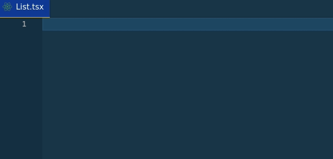
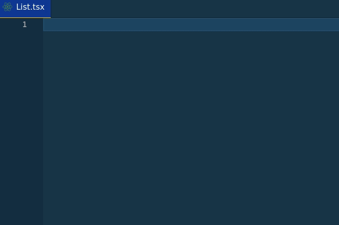
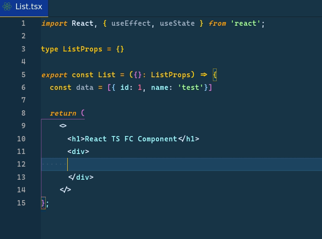

# React TypeScript Snippets for VS Code

This extension contains code snippets for React, TS, styled components, and is based on latest best practices.

## Examples

**Typescript FC component**

**Typescript FC component with hooks**

**JSX map an array**

## Snippets

| Snippet   | Purpose                                   |
| --------- | ----------------------------------------- |
| `tfc`     | Create Typescript FC component            |
| `tfch`    | Create Typescript FC component with hooks |
| `jsxpr`   | Print JSX data                            |
| `jsxmap`  | JSX map an array                          |
| `jsxmapr` | JSX map an array with Fragment            |
